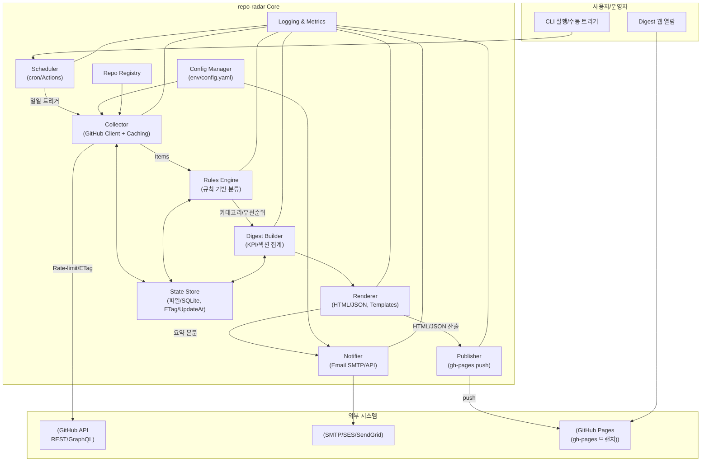
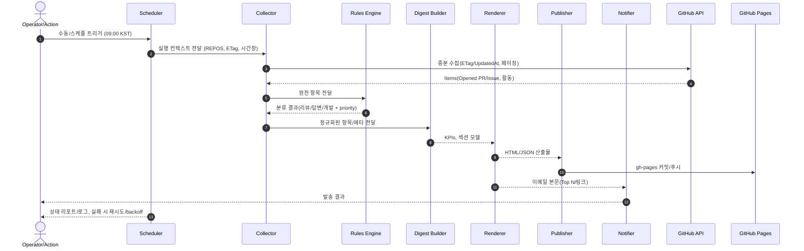
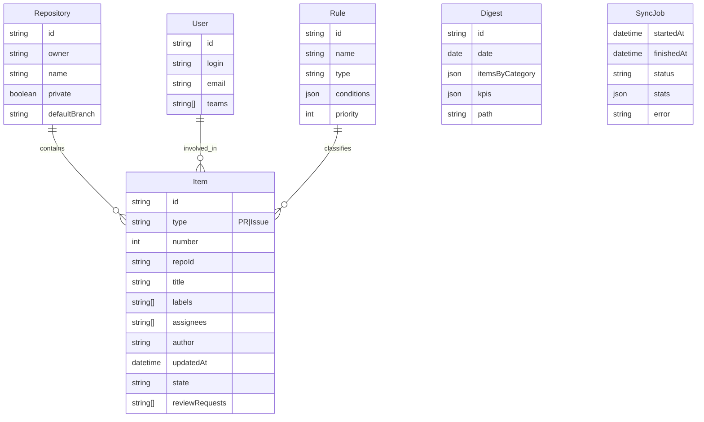

# repo-radar 아키텍처 설계 (v0.1 초안)

문서 버전: 0.1  
작성일: 2025-10-12  
대상: 요구사항 문서(`docs/requirements.md`) 기준 MVP~v0.3 범위

## 아키텍처 패턴 및 적용 이유

repo-radar의 아키텍처에는 다음과 같은 소프트웨어 아키텍처 패턴들이 반영되어 있습니다.

### 1. 레이어드 아키텍처(Layered Architecture)
- 설정, 레지스트리, 수집, 분류, 집계, 렌더링, 배포, 알림 등 각 기능이 명확히 분리된 계층 구조로 설계되어 있습니다.
- 각 계층은 상위 계층(예: Collector → Rules Engine → Digest Builder → Renderer)으로만 의존하며, 하위 계층의 세부 구현에 독립적입니다.
- **장점:** 유지보수 용이, 테스트 용이, 각 계층별 책임 명확.

### 2. 파이프라인/파이프-필터(Pipeline/Filter) 패턴
- 데이터가 Collector → Rules Engine → Digest Builder → Renderer → Publisher/Notifier로 순차적으로 흐르며, 각 단계에서 가공·필터링·집계가 이루어집니다.
- 각 단계는 입력을 받아 처리 후 다음 단계로 넘기는 구조로, 파이프라인 패턴의 전형적인 예시입니다.
- **장점:** 각 단계의 독립적 개선/확장, 병렬 처리 가능성.

### 3. 헥사고날(포트-어댑터, Hexagonal/Ports & Adapters) 패턴 요소
- Core(Collector, Rules Engine, Digest Builder 등)와 외부 시스템(GitHub API, SMTP, GitHub Pages)이 명확히 분리되어 있습니다.
- 외부 시스템과의 통신은 어댑터(Publisher, Notifier 등)를 통해 이루어지며, 내부 로직은 외부 변화에 영향을 덜 받도록 설계되어 있습니다.
- **장점:** 외부 API/서비스 교체 용이, 테스트 시 Mocking 용이.

### 4. 배치/스케줄러 기반 이벤트 트리거 패턴
- Scheduler가 주기적으로(또는 수동으로) 전체 파이프라인을 트리거하는 구조로, 이벤트 기반 배치 처리 패턴이 적용되어 있습니다.

#### 적용 이유 요약
- **유지보수성과 확장성:** 각 기능별로 책임이 분리되어 있어, 새로운 기능 추가나 외부 시스템 교체가 용이합니다.
- **테스트 용이성:** 각 계층/단계별로 단위 테스트 및 통합 테스트가 가능합니다.
- **실제 운영 환경 적합성:** GitHub Actions, 자체 서버 등 다양한 배포 옵션에 유연하게 대응할 수 있습니다.
- **실패 격리 및 복구 용이성:** 파이프라인 각 단계에서 실패/재시도 정책을 독립적으로 적용할 수 있습니다.

## 목표와 제약 요약
- 목표: 등록된 GitHub 리포지토리들의 PR/Issue 활동을 하루 1회 수집·분류하여 HTML Digest 생성, gh-pages 게시, 이메일 알림 발송
- 성능: 50개 리포, 최근 활동 5천 항목 기준 5분 내 수집·분류·렌더링
- 신뢰성: 작업 실패율 < 1%/일, 재시도 후 성공률 ≥ 99.9%
- 보안: 최소 권한 토큰, 비밀값은 환경변수/비밀저장소, 전송 시 TLS
- 배포: GitHub Actions(권장) 또는 자체 서버 크론

## 상위 아키텍처 개요
아래 다이어그램은 주요 컴포넌트와 외부 시스템, 데이터 흐름을 나타냅니다.



### 컴포넌트 책임
- Scheduler: 일일 실행(시간대/Quiet hours), 수동 트리거, 백오프 재시도 정책 적용
- Repo Registry: 등록/삭제/목록, private 접근 시 최소 권한 토큰 필요
- Collector: GitHub API 연동, 요청 배치/페이징, ETag 캐시/If-None-Match, UpdatedAt 증분 수집
- Rules Engine: 리뷰/답변/개발 카테고리 규칙 적용, 라벨/Assignee/키워드/상태 기반 분류, 우선순위 계산
- Digest Builder: KPI(대기 PR 수/평균 대기일 등), 섹션 구성, 항목 선택/정렬
- Renderer: 템플릿 기반(예: Jinja2/Nunjucks 계열) HTML 필수, JSON 선택
- Publisher: gh-pages 브랜치 커밋/푸시, 날짜별 아카이브 경로(/yyyy-mm-dd/index.html)
- Notifier: 이메일 요약(Top N + 전체 링크) 발송, SMTP/SES/SendGrid 인터페이스
- State Store: 규칙/설정/캐시/실행 이력 저장(파일/SQLite), 비밀은 환경변수/시크릿에 저장
- Logging & Metrics: info/warn/error, 수집 시간·항목 수·실패율, 실패 시 제목 [FAIL]

## 일일 배치 시퀀스



## 데이터 모델(초안)
요구사항의 8장 모델을 기반으로 실체와 관계를 단순화해 표현합니다.



## 배포 옵션
- 옵션 A: GitHub Actions
  - cron 스케줄 + Python 실행 -> Pages 배포 -> 이메일 발송(Secrets 사용)
  - 장점: 관리 용이, 권한 분리 용이, Pages 연동 쉬움
- 옵션 B: 자체 서버/컨테이너
  - 시스템 cron + 환경변수/시크릿 주입 -> SMTP/Pages 푸시
  - 장점: 커스텀 가능, Private 네트워크에서 실행 가능

## 실패/재시도·레이트리밋 전략
- 네트워크/API 오류: 지수 백오프(예: 1s, 2s, 4s, 8s, 최대 5회), idempotent 설계
- GitHub Rate limit: 남은 쿼터/리셋 시간 확인, 요청 배치/필드 선택, ETag/If-None-Match 적극 활용
- 부분 실패 허용: 일부 리포 실패 시 나머지 진행, 알림에는 [PARTIAL] 표시

## 보안/프라이버시
- 비밀값은 환경변수/시크릿 스토어에만 저장(GITHUB_TOKEN, SMTP 자격)
- Pages는 기본 공개, Private 항목은 링크/메타만 표시 옵션 제공
- 감사 로그: 토큰 미출력, 오류 시에도 민감정보 마스킹

## 설정 키 맵핑(예시)
- TIMEZONE, DAILY_AT, QUIET_HOURS
- REPOS[], RULES_FILE, BASE_URL
- GH_PAGES_REPO, GH_PAGES_BRANCH
- EMAIL_SMTP_* / 또는 EMAIL_PROVIDER=ses|sendgrid
- GITHUB_TOKEN

## 디렉토리 스켈레톤 제안
코드 구조는 추후 구현 시 다음과 같이 모듈 분리를 권장합니다.

```
repo-radar/
├─ main.py                # CLI 엔트리포인트
├─ repo_radar/
│  ├─ config.py           # 설정 로딩/검증
│  ├─ registry.py         # 리포 등록/관리
│  ├─ github_client.py    # REST/GraphQL, rate limit, ETag
│  ├─ collector.py        # 증분 수집 파이프라인
│  ├─ rules.py            # 규칙 DSL/매칭
│  ├─ digest.py           # KPI/섹션 집계
│  ├─ renderer.py         # 템플릿 렌더링(HTML/JSON)
│  ├─ publisher.py        # gh-pages 배포
│  ├─ notifier.py         # 이메일 발송
│  ├─ state.py            # 파일/SQLite 상태 저장
│  └─ logging.py          # 구조적 로깅/메트릭
└─ templates/
   ├─ base.html
   └─ digest.html
```

## 향후 확장 포인트
- GraphQL 최적화(v0.3)로 호출 수 축소
- 규칙 파일 커스터마이즈/템플릿 번역 키 도입(다국어)
- 팀/조직 단위 보드, UI 설정 페이지(v1.0)

---
이 문서는 `docs/requirements.md`의 요구사항을 충족하는 구현 가이드를 제공하며, Mermaid 다이어그램은 VS Code Markdown Preview에서 바로 렌더링됩니다.
